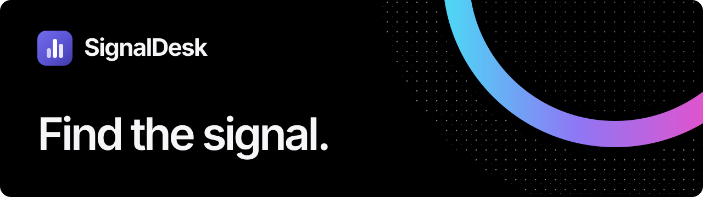

<p align="center">
  <a href="https://signaldesk.run">
    
  </a>
</p>

<p align="center">
  <a href="https://signaldesk.run">Website</a>
  ·
  <a href="https://github.com/rjhllc/signaldesk/releases/latest">Download SignalDesk</a>
  ·
  <a href="PRIVACY.md">Privacy</a>
  ·
  <a href="mailto:support@signaldesk.run">Support</a>
</p>

## What SignalDesk does

SignalDesk turns a live X API search into a structured research report. It keeps the original result set intact, supports precise native X filters, and can create separate AI-ranked or AI-filtered views with conversational follow-ups after results are retrieved.

| Research workflow | Local control | Evidence |
|---|---|---|
| Live X searches, advanced operators, sentiment summaries, CSV export | Encrypted credentials, locally saved search setups, no SignalDesk account | Exact query previews, request diagnostics, original and closable AI result tabs |

### Highlights

- Search live X data by topic, phrase, handle, entity, URL, engagement, location, or conversation reference.
- Preserve an **Original** result tab while each AI review or follow-up opens a separate, closable tab.
- Follow up with corrections, sort every result view, and restore a recently closed AI tab with **Ctrl+Z** or **Cmd+Z**.
- Show each AI processing stage, instruction conversation, and configured model.
- Restart the local backend without restarting the application or deleting saved settings.
- Export the currently selected result view to CSV.

## Install

Open the [latest SignalDesk release](https://github.com/rjhllc/signaldesk/releases/latest), then choose your platform:

### Windows

Download `SignalDesk-Setup-Windows-x64.exe`, open it, choose the installation folder, and select **Install**.

### macOS

Download `SignalDesk-macOS-universal.dmg`, open it, and drag SignalDesk into **Applications**. The universal build supports Apple Silicon and Intel Macs.

### Linux

Download `SignalDesk-Linux-amd64.deb` and open it with your desktop's software installer.

Every packaged build includes its required runtime. Users do not need to install Python, Bun, or Node.js.

## First launch

SignalDesk connects directly to providers on the user's behalf. There is no SignalDesk account or hosted proxy.

### Required: X API Bearer Token

Create an app in the [X Developer Portal](https://developer.x.com/en/portal/dashboard), copy its Bearer Token, and paste it into SignalDesk's Credentials window. SignalDesk encrypts it locally and sends it only to X.

### Optional: AI review

AI filtering is optional. Choose **OpenAI** or **Anthropic**, paste that provider's API key, and select a current model. SignalDesk defaults to GPT-5.6 Sol for OpenAI and Fable 5 for Anthropic. A custom model-ID option supports future models.

X, OpenAI, and Anthropic may require separate paid API access. SignalDesk does not receive those payments or credentials.


## Privacy boundary

SignalDesk has no analytics SDK, advertising SDK, crash-reporting service, SignalDesk account, or SignalDesk-operated collection endpoint.

- Credentials are encrypted for the current operating-system account and stored outside the installed application files.
- Saved search definitions remain in local application storage.
- Search queries are sent directly to X only when a search is run.
- Original posts and the user's cumulative review conversation are sent to the configured LLM provider only when AI review is explicitly requested.
- Update checks contact the public GitHub release feed and do not include credentials, searches, or results.

See [PRIVACY.md](PRIVACY.md) for the complete data-flow disclosure.

<details>
<summary><strong>Developer setup</strong> — not required to install or use SignalDesk</summary>

To modify or build the source, install Bun 1.3.14 or newer and Python 3.13:

```bash
bun install --frozen-lockfile
bun run test
bun run start
```

Build a local Windows installer with:

```bash
bun run build:windows
```

Generated builds, local credentials, caches, diagnostic screenshots, and transfer artifacts are excluded from version control.

</details>

## Releases

Pushing a version tag such as `v0.1.0-alpha.1` runs one release workflow for Windows, macOS, and Linux. It verifies the version, runs all tests, builds each native package, validates the package privacy boundary, publishes exactly three user installers here, and sends machine-readable updater assets to `rjhllc/signaldesk-updates`.

## Ownership

SignalDesk is proprietary software owned by RJH LLC. This public repository contains the source, documentation, automated cross-platform release workflow, and official application releases.
